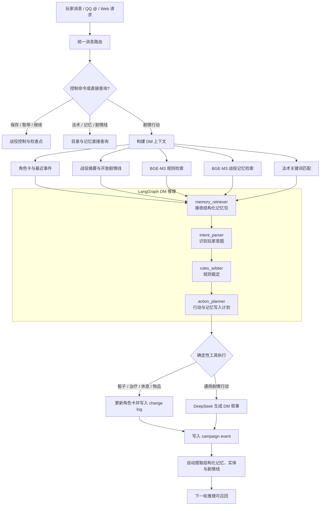

[English](README.md) | **简体中文**

# DND DM Agent

一个面向长期 DND 战役的本地优先 AI 地城主系统。

它不只负责生成一段 DM 叙事，还维护角色卡、战役事件、结构化记忆、剧情线、规则书、法术目录与检查点，并可通过 NapCat 接入 QQ 群聊和私聊。

系统使用 LangGraph 编排 DM 推理阶段，使用 DeepSeek 生成叙事，使用本地 BGE-M3 完成规则和战役记忆的语义检索。关键状态变化由确定性 Python 工具执行并记录，LLM 不直接修改数据库。

## 核心能力

### 可持续的战役记忆

- 使用 append-only 事件日志保留完整战役历史。
- 自动从新事件中提取结构化记忆、参与实体和开放剧情线。
- 结合 BGE-M3 语义相似度、关键词、重要度和当前会话进行记忆召回。
- 将相关记忆、实体状态、剧情线、摘要和最近事件注入 DM 推理上下文。
- 支持对旧战役事件执行增量、幂等的记忆回填。
- 使用摘要压缩长会话，并通过检查点保存战役和全部角色状态。

### 可审计的 DM 推理

- LangGraph 依次执行记忆检索、意图解析、规则裁定和行动规划。
- 支持角色行动、战斗、社交、休息、物品使用与施法等意图。
- 骰子、治疗、物品消耗和角色状态修改由工具执行。
- 每次角色修改写入 change log，每次行动写入 campaign event。
- 事件会记录使用过的规则、法术、记忆、摘要、角色版本和图规划结果。
- DeepSeek 未配置或暂时不可用时，确定性工具和降级回复仍可工作。

### 角色卡与车卡

- 从结构化请求创建 DND 5E 角色卡。
- 根据 Excel 人物卡模板提取并实现购点、属性调整值、熟练加值、技能、豁免、HP、AC 与施法属性规则。
- 使用统一结构化背包保存全部携带物与装备，包括武器、护甲、消耗品、容器、充能、效果、货币和任意自定义物品。
- 支持角色版本、状态修改日志、法术、特性和背景资料。
- 可将角色数据回填并导出为 Excel 人物卡。
- 支持维护 QQ 用户与战役角色卡的绑定关系。

所有物品只在 `character.data.inventory` 中保存一次。装备通过 `equipped` 和
`equipped_slot` 表示；自定义物品可以将任意规则写入 `custom_data`，未知扩展字段也会原样保留。

```json
{
  "instance_id": "item_unique_instance",
  "item_id": "clockwork_teapot",
  "name": "发条抓钩茶壶",
  "item_type": "custom",
  "quantity": 1,
  "equipped": true,
  "equipped_slot": "off_hand",
  "weight_each": 2.5,
  "charges": {"current": 2, "maximum": 3, "recharge": "dawn"},
  "effects": [{"effect_type": "movement", "description": "将持有者拉近 20 尺。"}],
  "custom_data": {"brew_temperature": 92, "experimental": true}
}
```

### 规则书、法术与多文件解析

- 解析文本、Markdown、JSON、CSV、HTML、DOCX、PPTX、PDF 和 ZIP。
- 可选安装 PaddleOCR、PDF OCR、Whisper 与 MarkItDown 后端。
- 将解析后的规则书切块并使用本地 BGE-M3 建立检索索引。
- 合并多个 Excel 法术表，支持中英文名称、关键词和自然语言直接查法术。
- 在施法相关行动中自动把匹配法术条目加入 DM 上下文。

### QQ / NapCat 接入

- 支持 NapCat / OneBot v11 私聊与群聊。
- 群聊默认仅在 `@机器人` 时触发，私聊直接触发。
- 白名单为空时允许所有用户使用。
- 支持下载并解析 QQ 消息附件。
- DM 控制命令和普通玩家权限分离。
- 提供 Windows 一键启动、登录和 QQ 角色绑定脚本。

## LangGraph 推理图

当前 LangGraph 负责推理和行动规划，工具执行、状态落库及记忆索引由服务层完成。这种设计让自然语言推理保持灵活，同时让角色数值和战役状态可验证、可回滚、可审计。



## 战役记忆模型

| 层级 | 作用 |
| --- | --- |
| `CampaignEvent` | 不可变的原始行动与结果日志，负责审计 |
| `CampaignSummary` | 压缩会话或战役历史，降低上下文长度 |
| `CampaignMemory` | 可检索的事实、决定、事件和剧情线记忆 |
| `CampaignEntity` | 角色及其他实体的当前状态 |
| `CampaignThread` | 尚未解决的任务、承诺和剧情线 |
| `CampaignCheckpoint` | 保存战役配置与全部角色快照 |

常用记忆命令：

```text
/记忆 银钥匙
/剧情线
```

## 技术栈

- Backend: Python 3.12、FastAPI、SQLAlchemy、LangGraph
- LLM: DeepSeek OpenAI-compatible API
- Embedding: 本地 `BAAI/bge-m3`，1024 维向量
- Storage: SQLite 本地模式，或 PostgreSQL + pgvector
- Frontend: Next.js 16、React 19
- Integration: NapCat / OneBot v11
- Tooling: uv、Docker Compose、pytest

## 快速开始

### 本地后端

需要 Python 3.12 和 [uv](https://docs.astral.sh/uv/)。

```powershell
Copy-Item .env.example .env
cd backend
uv sync
$env:DATABASE_URL="sqlite:///../data/local_dnd_dm.db"
$env:DATA_DIR="../data"
uv run uvicorn app.main:app --host 127.0.0.1 --port 8000
```

访问：

- API 文档：<http://127.0.0.1:8000/docs>
- 健康检查：<http://127.0.0.1:8000/health>

初始化示例战役：

```powershell
Invoke-RestMethod -Method Post http://127.0.0.1:8000/demo/bootstrap
Invoke-RestMethod -Method Post http://127.0.0.1:8000/ingest/compendium
Invoke-RestMethod -Method Post http://127.0.0.1:8000/ingest/rules
```

### 前端

```powershell
cd frontend
npm install
npm run dev
```

访问 <http://localhost:3000>。

### Docker Compose

Docker 模式会启动 PostgreSQL、pgvector、Redis、后端、worker、前端与 Adminer。

```powershell
Copy-Item .env.example .env
docker compose up --build -d
```

| 服务 | 地址 |
| --- | --- |
| Web UI | <http://localhost:3000> |
| API / Swagger | <http://localhost:8000/docs> |
| Adminer | <http://localhost:8080> |

## 配置

核心环境变量：

```env
DEEPSEEK_API_KEY=
DEEPSEEK_BASE_URL=https://api.deepseek.com
LLM_MODEL=deepseek-chat

EMBEDDING_MODEL=BAAI/bge-m3
EMBEDDING_BACKEND=local_bge_m3
EMBEDDING_DEVICE=auto

NAPCAT_BASE_URL=
NAPCAT_TOKEN=
NAPCAT_SELF_ID=
NAPCAT_ALLOWED_USER_IDS=
NAPCAT_DM_USER_IDS=
NAPCAT_REQUIRE_GROUP_AT=true
```

- `NAPCAT_ALLOWED_USER_IDS` 为空：所有 QQ 用户可用。
- `NAPCAT_DM_USER_IDS` 为空：QQ 用户均不能执行 DM 控制命令。
- `NAPCAT_REQUIRE_GROUP_AT=true`：群聊必须 `@机器人`。

## NapCat / QQ

Windows 下可使用：

```text
login_napcat_dnd.bat
run_napcat_callback.bat
run_napcat_localqq.bat
manage_qq_bindings.bat
```

NapCat OneBot HTTP Post URL：

```text
http://127.0.0.1:8010/napcat/callback
```

维护 QQ 用户与角色卡绑定：

```powershell
manage_qq_bindings.bat characters
manage_qq_bindings.bat list
manage_qq_bindings.bat bind 123456789 char_001 --name 玩家昵称
manage_qq_bindings.bat unbind 123456789
```

NapCat 本体及运行时不包含在本仓库中，请自行安装并设置 `NAPCAT_SOURCE_DIR`，或调整启动脚本中的路径。

## 导入规则书与原始资料

公开仓库不包含第三方规则书、人物卡模板、法术表、真实战役数据库或生成后的角色卡。请将你有权使用的资料放入：

```text
data/raw/
```

解析并导入规则书：

```powershell
curl.exe -X POST http://127.0.0.1:8000/parse/rulebooks `
  -F "files=@data/raw/your-rulebook.pdf" `
  -F "system_version=DND_5E_2014"
```

安装可选解析后端：

```powershell
uv run scripts/install_parse_backends.py --backend pdf_ocr
uv run scripts/install_parse_backends.py --backend whisper
uv run scripts/install_parse_backends.py --backend markitdown
```

## 常用 API

| 功能 | API |
| --- | --- |
| DM 对话 | `POST /chat/{campaign_id}` |
| 多文件解析 | `POST /parse/files` |
| 规则书解析入库 | `POST /parse/rulebooks` |
| 规则检索 | `GET /rules/search` |
| 法术检索 | `GET /spells` |
| 创建角色卡 | `POST /characters/build` |
| 物品 Schema | `GET /characters/items/schema` |
| 升级已有角色物品 | `POST /campaigns/{campaign_id}/characters/inventory/normalize` |
| 导出人物卡 | `GET /characters/{character_id}/sheet` |
| 战役事件 | `GET /campaigns/{campaign_id}/events` |
| 战役记忆 | `GET /campaigns/{campaign_id}/memories` |
| 实体状态 | `GET /campaigns/{campaign_id}/entities` |
| 开放剧情线 | `GET /campaigns/{campaign_id}/threads` |
| 历史记忆回填 | `POST /campaigns/{campaign_id}/memories/backfill` |
| 检查点 | `GET /campaigns/{campaign_id}/checkpoints` |
| QQ 角色绑定 | `/napcat/bindings` |

## 战役控制命令

```text
/帮助
/状态
/保存    DM only
/暂停    DM only
/继续    DM only
/法术 火球术
/记忆 银钥匙
/剧情线
```

## 测试

```powershell
cd backend
uv run pytest -q

cd ../frontend
npm run build
```

## 项目结构

```text
backend/app/
  agents/dm_graph.py       LangGraph DM 推理图
  campaign_memory.py       记忆提取、回填与召回
  campaign_control.py      保存、暂停、继续与检查点
  message_router.py        QQ 与 HTTP 共用的消息路由
  services.py              上下文构建、工具执行与事件写入
  parsing/                 多文件与多模态解析
  rag/                     BGE-M3 embedding 与规则检索
  tools/                   骰子、车卡、公式与法术目录
frontend/                  Next.js Web UI
scripts/                   可选解析后端安装脚本
data/                      本地规则、原始资料和运行数据
```

## 当前边界

- LangGraph 当前覆盖 DM 推理与规划流程，工具执行仍由服务层完成。
- 结构化记忆提取当前以确定性规则为主，后续可增加 LLM 提取与人工确认。
- 通用战斗回合、地图位置和完整遭遇管理仍需要继续扩展。
- 本项目不附带 DND 规则书、人物卡模板、NapCat 或其他第三方受版权保护的资料。
