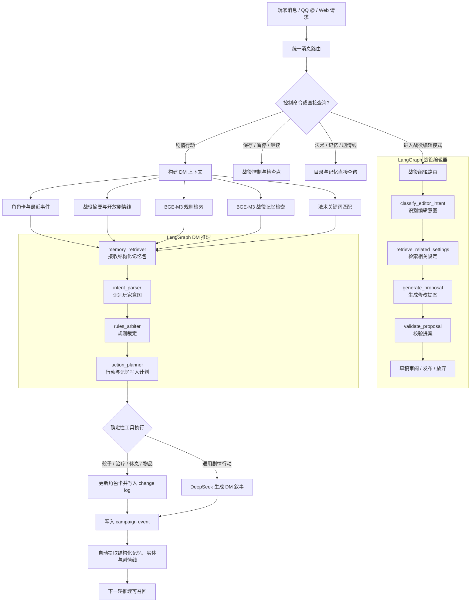

[English](README.md) | **简体中文**

# DND DM Agent

一个面向长期 DND 战役的本地优先 AI 跑团系统。它同时提供完整的 **DM 模式** 与工具型
**骰娘模式**，两种模式运行在同一个战役、角色卡、记忆和战斗状态之上，可以随时切换。

系统并不把跑团理解为一次性的聊天生成。角色卡、NPC、怪物、物品、Buff、战役设定、
剧情进度、事件、记忆和战斗状态都是可查询、可修改、可审计的结构化数据。LLM 负责理解
自然语言、叙述和扮演；确定性 Python 工具负责投骰、数值计算、状态更新和数据落库。

## 两种游玩模式

### DM 模式

DM 模式由 AI 担任地下城主，适合直接主持完整战役。

- 根据当前场景、战役设定、历史事件和角色行动推进剧情。
- 描写环境、冲突与行动结果，并扮演在场 NPC 和怪物。
- 读取 NPC 私密设定、秘密、动机、说话方式、剧情职责和计划行动。
- 在行动中检索规则书、法术表、角色卡和战役记忆，保持前后事实一致。
- 自动记录事件、角色变化、剧情线和结构化记忆，为长期战役持续提供上下文。
- 在战斗中使用与骰娘模式完全相同的确定性机械系统，但保留战斗叙述、NPC 扮演和剧情表现。

### 骰娘模式

骰娘模式面向真实玩家与真实 DM。它不主动推进剧情，也不替真实 DM 描写环境或扮演 NPC，
但保留完整的跑团工具能力。

- 查询角色卡、技能、法术、规则、物品、战役进度和已记录事实。
- 执行检定、投骰、伤害、治疗、物品消耗、效果更新和战斗主持。
- 继续使用当前战役、当前场景、角色、公开设定和记忆；切换模式不会切换战役。
- 审计群聊中的操作与在场角色，并可读取当前消息、引用消息或经确认后的前文来更新记忆。
- 输出仅包含事实、规则、计算、状态变化和必要澄清，不主动给建议、续写剧情或输出扮演文字。

## DM 战役系统

### 战役推进与长期记忆

系统使用事件日志记录每次行动和结果，并从事件中维护结构化记忆、实体状态、剧情线与摘要。
DM 推理会召回与当前行动相关的近期事件、长期事实、角色关系、开放任务和战役设定。

- 支持自由扮演、非战斗回合制和战斗回合制。
- 支持暂停、继续、保存检查点以及完整战役状态恢复。
- 使用 BGE-M3 检索规则书和战役记忆，长战役可通过摘要压缩上下文。
- 每次角色修改写入 change log，每次行动写入 campaign event。
- 事件记录使用过的规则、法术、记忆、角色版本、投骰和状态变化，便于审计。

### 对话式战役编辑

DM 可以进入独立的战役编辑模式，通过对话创建或修改地点、NPC、阵营、传说、任务、
时间线、规则及任意自定义设定。编辑不会推进剧情或战斗。

- 修改先生成草稿，经审阅后发布。
- 支持评论、撤销、放弃、冲突检查和版本历史。
- 支持设定关系图、时间线、开局模板、NPC 转换和战役包导入导出。
- 正常游玩时会召回已发布设定；剧情与既有设定冲突时可生成待审更新草稿。

### NPC 与怪物

NPC 和怪物使用与玩家相同的结构化角色卡和战斗系统，并增加供 DM 使用的私密资料：
公开形象、声音、习惯、目标、恐惧、秘密、知识、态度、扮演指引、剧情职责、触发条件和
计划行动。在场状态决定它们是否进入当前场景和战斗。

## 共享战斗系统

详细说明：[战斗系统](docs/COMBAT_SYSTEM-cn.md) | [English](docs/COMBAT_SYSTEM.md)

DM 模式与骰娘模式共用同一条战斗机械管线。两者的先攻、角色卡读取、目标识别、反应、
投骰、效果和回合推进规则完全一致；区别仅在于 DM 模式允许叙述和扮演。

### 回合与参战者

- 开始战斗前确认所有参战角色；没有实体角色卡的角色不能加入战斗。
- 系统为所有参战玩家、NPC 和怪物投掷先攻并进入回合制。
- 当前回合只接受对应玩家或 DM 的行动。
- 轮到玩家角色时，通过 NapCat `@` 绑定该角色的 QQ 用户。
- 行动结算完成后自动推进回合；战斗结束后自动返回自由扮演模式。

### 角色卡、目标卡与数值

- 每次战斗行动都读取全部参战者的裁剪机械卡，并额外匹配行动目标卡。
- AC、HP、属性调整值、技能、豁免、先攻和施法数值来自实体角色卡，禁止使用聊天中的假设值。
- 玩家、NPC 和怪物共用角色卡 Schema、物品、法术、效果与修改历史。
- QQ 与角色卡绑定按战役独立维护；切换战役时同步切换绑定角色。

### 效果与反应

- 基础角色卡保持不变，装备、Buff、Debuff、法术和自定义物品通过持续效果实时生成
  `effective` 机械快照。
- 支持持续时间、叠加、集中、优势/劣势、额外骰、一次性消耗和战斗结束清理。
- 可能触发反应的行动先显示行动声明，不提前投骰。
- 系统先 `@` 所有可反应玩家并等待决定；自动控制角色也会明确决定是否反应。
- 所有反应完成后才执行投骰、结算行动并推进回合。

## 支撑能力

### 角色卡、物品与车卡

- 根据 Excel 人物卡模板实现购点、调整值、熟练、技能、豁免、HP、AC 和施法计算。
- 统一结构化保存武器、护甲、消耗品、容器、充能、货币、装备效果和任意自定义物品。
- 支持角色版本、状态变更历史、Excel 导出及 QQ 绑定管理。

### 规则、法术与多文件解析

- 解析文本、Markdown、JSON、CSV、HTML、DOCX、PPTX、PDF 和 ZIP。
- 使用本地 BGE-M3 为规则书和战役记忆建立检索索引。
- 合并多个 Excel 法术表，支持中英文名称、关键词和自然语言查询。
- 在相关行动中自动注入匹配的规则和法术条目。

### QQ / NapCat

- 支持 OneBot v11 群聊与私聊；群聊默认需要 `@机器人`。
- 支持消息引用、群聊历史确认、附件下载与多文件解析。
- 白名单为空时允许所有用户使用，并区分 DM 权限与普通玩家权限。
- 提供 Windows 一键启动、登录和角色绑定脚本。

## LLM Agent 工具架构

v2.0 起改为 LLM Function-Calling Agent 模式。用户自然语言 → LLM 理解意图 → 调用 Python 工具
→ 结构化数据库读写 → 叙事反馈。不再依赖关键词匹配或状态机阻塞。

```
用户: "帮我创建卡利恩，3级人类法师，力量16敏捷14"
  → LLM: tool_call → create_character_quick(name="卡利恩", class="法师", level=3, ...)
  → characters 表写入结构化数据 → 绑定 QQ → "角色卡已创建"

用户: "我用长剑攻击地精"
  → LLM: tool_call → combat_attack(target="地精", weapon="长剑")
  → roll_dice("1d20+5") → 伤害结算 → HP 更新 → "命中，造成8点挥砍伤害"
```

### 工具分类

| 类别 | 工具 | 写入表 |
|------|------|--------|
| 角色卡 | `create_character_quick`, `create_npc_quick`, `create_character_draft`, `update_character_draft`, `commit_character_draft` | `characters` |
| 战役设定 | `create_setting_draft`, `publish_setting_drafts`, `save_campaign_setting` | `campaign_settings` |
| 战斗 | `combat_attack`, `combat_cast_spell`, `combat_ability_check`, `combat_dash`, `combat_disengage`, `combat_dodge` | `characters` (HP/状态) |
| 追问 | `ask_clarification` | 不消耗回合 |
| 绑定导出 | `bind_character`, `show_bindings`, `export_character_sheet` | `napcat_character_bindings` |
| 战役控制 | `status`, `save`, `pause`, `resume`, `enter_turn_mode`, `start_combat`, `end_combat` 等 | `campaigns` |

## LangGraph 推理图

当前 LangGraph 负责推理和行动规划，工具执行、状态落库及记忆索引由服务层完成。这种设计让自然语言推理保持灵活，同时让角色数值和战役状态可验证、可回滚、可审计。



## 战役记忆模型

| 层级 | 作用 |
| --- | --- |
| `CampaignEvent` | 不可变的原始行动与结果日志，负责审计 |
| `CampaignSummary` | 压缩会话或战役历史，降低上下文长度 |
| `CampaignMemory` | 可检索的事实、决定、事件和剧情线记忆 |
| `CampaignEntity` | 角色及其他实体的当前状态 |
| `CampaignThread` | 尚未解决的任务、承诺和剧情线 |
| `CampaignCheckpoint` | 保存战役配置与全部角色快照 |

常用记忆命令：

```text
/记忆 银钥匙
/剧情线
/回合模式
/退出回合模式
/进入战斗    DM only
/结束战斗    DM only
/下一回合    DM only
```

## 技术栈

- Backend: Python 3.12、FastAPI、SQLAlchemy、LangGraph
- LLM: DeepSeek OpenAI-compatible API
- Embedding: 本地 `BAAI/bge-m3`，1024 维向量
- Storage: SQLite 本地模式，或 PostgreSQL + pgvector
- Frontend: Next.js 16、React 19
- Integration: NapCat / OneBot v11
- Tooling: uv、Docker Compose、pytest

## 快速开始

### 本地后端

需要 Python 3.12 和 [uv](https://docs.astral.sh/uv/)。

```powershell
Copy-Item .env.example .env
cd backend
uv sync
uv run uvicorn app.main:app --host 127.0.0.1 --port 8011
```

访问：

- API 文档：<http://127.0.0.1:8011/docs>
- 健康检查：<http://127.0.0.1:8011/health>

现在所有本地入口默认共用同一个 SQLite 数据库：
`D:\mcp\DM_agent\data\dm_agent.db`

初始化示例战役：

```powershell
Invoke-RestMethod -Method Post http://127.0.0.1:8011/demo/bootstrap
Invoke-RestMethod -Method Post http://127.0.0.1:8011/ingest/compendium
Invoke-RestMethod -Method Post http://127.0.0.1:8011/ingest/rules
```

### 前端

```powershell
run_webui.bat
```

访问 <http://127.0.0.1:3001>。端口 `3000` 保留给本地 NapCat OneBot HTTP 服务。最新版 WebUI 包含游玩与回合控制、对话式战役编辑、草稿审阅、记忆与剧情线、规则/法术检索和角色状态。

### Docker Compose

Docker 模式会启动 PostgreSQL、pgvector、Redis、后端、worker、前端与 Adminer。

```powershell
Copy-Item .env.example .env
docker compose up --build -d
```

| 服务 | 地址 |
| --- | --- |
| Web UI | <http://localhost:3000> |
| API / Swagger | <http://localhost:8011/docs> |
| Adminer | <http://localhost:8080> |

## 配置

核心环境变量：

```env
DEEPSEEK_API_KEY=
DEEPSEEK_BASE_URL=https://api.deepseek.com
LLM_MODEL=deepseek-chat

EMBEDDING_MODEL=BAAI/bge-m3
EMBEDDING_BACKEND=local_bge_m3
EMBEDDING_DEVICE=auto

NAPCAT_BASE_URL=
NAPCAT_TOKEN=
NAPCAT_SELF_ID=
NAPCAT_ALLOWED_USER_IDS=
NAPCAT_DM_USER_IDS=
NAPCAT_REQUIRE_GROUP_AT=true
```

- `NAPCAT_ALLOWED_USER_IDS` 为空：所有 QQ 用户可用。
- `NAPCAT_DM_USER_IDS` 为空：QQ 用户均不能执行 DM 控制命令。
- `NAPCAT_REQUIRE_GROUP_AT=true`：群聊必须 `@机器人`。

## NapCat / QQ

Windows 下可使用：

```text
login_napcat_dnd.bat
run_napcat_installedqq.bat
run_napcat_callback.bat
run_napcat_localqq.bat
manage_qq_bindings.bat
```

- `login_napcat_dnd.bat`：推荐入口，同时启动 DM callback 并打开已安装 QQ。
- `run_napcat_installedqq.bat`：只启动 NapCat 注入后的已安装 QQ。
- 为 QQ 启动脚本追加 `--check`，可只检查安装路径而不打开 QQ。

NapCat OneBot HTTP Post URL：

```text
http://127.0.0.1:8011/napcat/callback
```

维护 QQ 用户与角色卡绑定：

```powershell
manage_qq_bindings.bat characters
manage_qq_bindings.bat list
manage_qq_bindings.bat bind 123456789 char_001 --name 玩家昵称
manage_qq_bindings.bat unbind 123456789
```

NapCat 已迁移为仓库外共享运行时 `D:\mcp\napcat`。启动脚本优先使用 `D:\mcp\napcat\pkg`，也支持通过 `NAPCAT_SOURCE_DIR` 覆盖路径；默认 callback 端口为 `8011`，可通过 `NAPCAT_CALLBACK_PORT` 覆盖。

## 导入规则书与原始资料

公开仓库不包含第三方规则书、人物卡模板、法术表、真实战役数据库或生成后的角色卡。请将你有权使用的资料放入：

```text
data/raw/
```

解析并导入规则书：

```powershell
curl.exe -X POST http://127.0.0.1:8011/parse/rulebooks `
  -F "files=@data/raw/your-rulebook.pdf" `
  -F "system_version=DND_5E_2014"
```

安装可选解析后端：

```powershell
uv run scripts/install_parse_backends.py --backend pdf_ocr
uv run scripts/install_parse_backends.py --backend whisper
uv run scripts/install_parse_backends.py --backend markitdown
```

## 常用 API

| 功能 | API |
| --- | --- |
| DM 对话 | `POST /chat/{campaign_id}` |
| 多文件解析 | `POST /parse/files` |
| 规则书解析入库 | `POST /parse/rulebooks` |
| 规则检索 | `GET /rules/search` |
| 法术检索 | `GET /spells` |
| 创建角色卡 | `POST /characters/build` |
| NPC 与怪物角色卡 | `GET /campaigns/{campaign_id}/actors` |
| DM 角色扮演资料 | `GET/PATCH /characters/{character_id}/roleplay` |
| 角色在场状态 | `PATCH /characters/{character_id}/presence` |
| 物品 Schema | `GET /characters/items/schema` |
| 升级已有角色物品 | `POST /campaigns/{campaign_id}/characters/inventory/normalize` |
| 查看持续效果 JSON Schema | `GET /characters/effects/schema` |
| 查看角色实时有效机械快照 | `GET /characters/{character_id}/effective` |
| 导出人物卡 | `GET /characters/{character_id}/sheet` |
| 战役事件 | `GET /campaigns/{campaign_id}/events` |
| 战役记忆 | `GET /campaigns/{campaign_id}/memories` |
| 已发布设定与搜索 | `GET /campaigns/{campaign_id}/settings` |
| 设定草稿与发布 | `/campaigns/{campaign_id}/setting-drafts` |
| 设定历史与评论 | `/campaigns/{campaign_id}/setting-history`、`/setting-comments` |
| 设定校验与冲突 | `/campaigns/{campaign_id}/settings/validate`、`/settings/conflicts` |
| 设定关系图与时间线 | `/campaigns/{campaign_id}/setting-graph`、`/timeline` |
| 战役包导入导出 | `/campaigns/{campaign_id}/package` |
| 实体状态 | `GET /campaigns/{campaign_id}/entities` |
| 开放剧情线 | `GET /campaigns/{campaign_id}/threads` |
| 历史记忆回填 | `POST /campaigns/{campaign_id}/memories/backfill` |
| 检查点 | `GET /campaigns/{campaign_id}/checkpoints` |
| QQ 角色绑定与活动战役 | `/napcat/bindings`、`/napcat/active-campaign`、`PATCH /characters/{id}/qq-bindings` |

## 战役控制命令

```text
/帮助
/状态
/保存    DM only
/暂停    DM only
/继续    DM only
/法术 火球术
/记忆 银钥匙
/剧情线
/编辑战役      DM only
/查看草稿
/发布设定      DM only
/撤销修改      DM only
/放弃编辑      DM only
/退出编辑      DM only
/骰娘          DM only
/退出骰娘      DM only
```

## 测试

```powershell
cd backend
uv run pytest -q

cd ../frontend
npm run build
```

## 项目结构

```text
backend/app/
  agents/dm_graph.py       LangGraph DM 推理图
  agents/campaign_editor_graph.py  LangGraph 战役编辑图
  campaign_editor.py       结构化设定、草稿、历史与战役包
  campaign_memory.py       记忆提取、回填与召回
  campaign_control.py      保存、暂停、继续与检查点
  message_router.py        QQ 与 HTTP 共用的消息路由
  services.py              上下文构建、工具执行与事件写入
  parsing/                 多文件与多模态解析
  rag/                     BGE-M3 embedding 与规则检索
  tools/                   骰子、车卡、公式与法术目录
frontend/                  Next.js Web UI
scripts/                   可选解析后端安装脚本
data/                      本地规则、原始资料和运行数据
```

## 当前边界

- LangGraph 当前覆盖 DM 推理与规划流程，工具执行仍由服务层完成。
- 结构化记忆提取当前以确定性规则为主，后续可增加 LLM 提取与人工确认。
- 通用战斗回合、地图位置和完整遭遇管理仍需要继续扩展。
- 本项目不附带 DND 规则书、人物卡模板、NapCat 或其他第三方受版权保护的资料。
