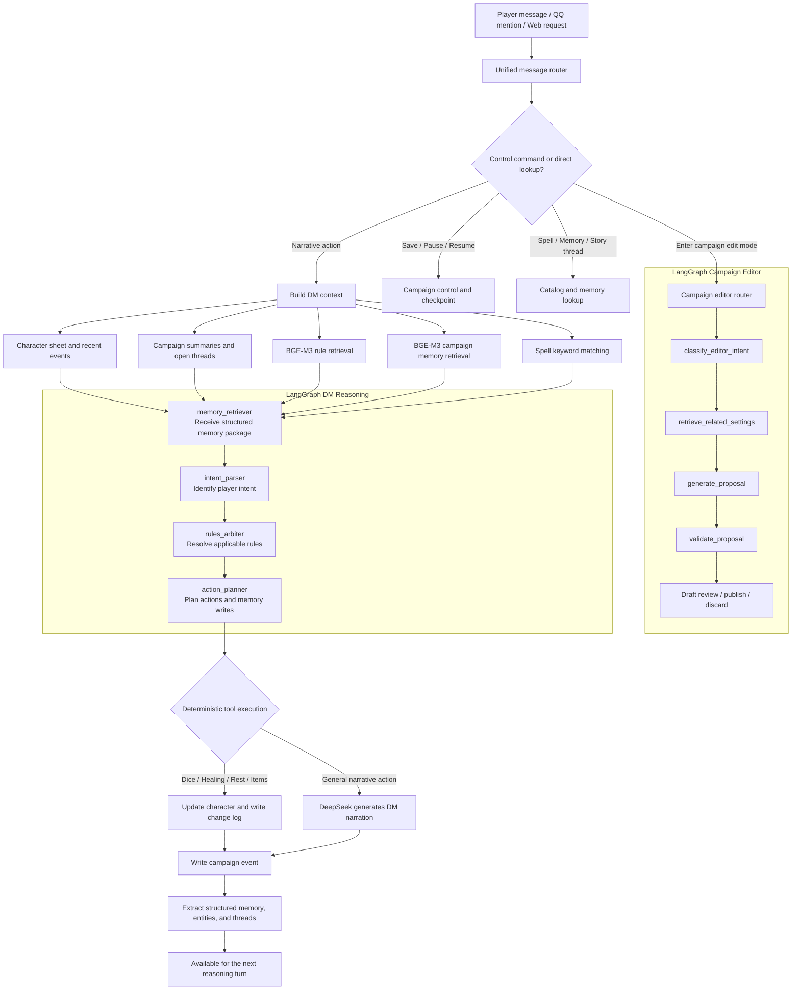

**English** | [简体中文](README-cn.md)

# DND DM Agent

A local-first AI Dungeon Master system designed for long-running DND campaigns.

It does more than generate DM narration. The system maintains character sheets, campaign events, structured memories, story threads, rulebooks, spell catalogs, and checkpoints, while supporting QQ group and private chat through NapCat.

LangGraph orchestrates the DM reasoning phase, DeepSeek generates narrative responses, and a local BGE-M3 model retrieves rules and campaign memories. Deterministic Python tools execute important state changes, so the LLM never modifies canonical game state directly.

## Core Capabilities

### Persistent Campaign Memory

- Preserves the complete campaign history as an append-only event log.
- Automatically extracts structured memories, participating entities, and open story threads from new events.
- Retrieves memories using BGE-M3 semantic similarity, keywords, importance, and current-session relevance.
- Injects relevant memories, entity state, story threads, summaries, and recent events into DM reasoning.
- Supports incremental and idempotent backfilling of memory from existing campaign events.
- Compresses long sessions with summaries and saves campaign plus character state through checkpoints.

### Conversational Campaign Editor

- Provides a DM-only campaign edit mode that is isolated from normal play and does not advance turns or write gameplay events.
- Uses an independent LangGraph workflow to classify editing intent, retrieve related settings, generate proposals, and validate them.
- Stores locations, NPCs, factions, lore, quests, timeline entries, rules, and arbitrary homebrew settings as structured records.
- Keeps proposed changes in drafts until the DM publishes them; drafts can be reviewed, commented on, resolved, undone, or discarded.
- Preserves an auditable version history for every published change and validates broken relationships or duplicate settings.
- Retrieves relevant published settings into normal DM reasoning and creates review drafts when new events appear to contradict established canon.
- Exposes relationship graphs, timelines, starter templates, NPC conversion, and portable campaign package import/export.

### Free-play and Turn-based Modes

- Campaigns default to free-play mode and may switch to turn-based mode through chat commands.
- Starting combat rolls initiative for every player character and NPC, then forces turn-based mode.
- NPC turns are controlled by the DM; player turns only accept actions from the bound character.
- After each valid action, the system advances the turn and mentions the next player through NapCat.
- Non-combat turn-based mode may be exited manually. Combat cannot exit turn-based mode until combat ends.
- Ending combat automatically returns the campaign to free-play mode.

### Auditable DM Reasoning

- LangGraph runs memory retrieval, intent parsing, rules arbitration, and action planning.
- Recognizes character, combat, social, rest, inventory, and spellcasting actions.
- Executes dice rolls, healing, item consumption, and character updates through deterministic tools.
- Records every character modification in a change log and every action in the campaign event log.
- Stores the rules, spells, memories, summaries, character version, and graph plan used for each event.
- Keeps deterministic tools and fallback responses available when DeepSeek is not configured or temporarily unavailable.

### Character Creation and Sheets

- Creates structured DND 5E character sheets from API requests.
- Implements point buy, ability modifiers, proficiency bonus, skills, saving throws, HP, AC, and spellcasting calculations extracted from an Excel character-sheet template.
- Stores every carried or equipped object in a unified structured inventory, including weapons, armor, consumables, containers, charges, effects, currency, and arbitrary homebrew items.
- Supports character versions, state-change history, spells, features, and background information.
- Exports character data back into an Excel character sheet.
- Maintains QQ user-to-character bindings for each campaign.

### NPC, Monster, and Dice Assistant Modes

- NPCs and monsters use the same structured character-sheet foundation as players, including abilities, combat values, spells, conditions, inventory, equipment, and change history.
- DM-controlled actors add private roleplay profiles: public persona, voice, mannerisms, goals, fears, secrets, knowledge, attitude, and explicit roleplay instructions.
- Story-role fields describe why an NPC exists, planned actions in the designed campaign, triggers, and relationships.
- Presence management determines which NPCs and monsters are currently in the scene and therefore included in initiative.
- During roleplay, relevant present DM actors and their private instructions are injected into DM reasoning. During combat, their turns are operated by the DM.
- Dice assistant mode does not replace the real DM or advance a preset plot, but it continuously audits mentioned operations and present actors while maintaining searchable memory.
- When mentioned to update memory, it reads the current or replied-to message by default and asks whether it should also ingest earlier group-chat history.
- When mentioned to start combat, it asks for participants and initiative advantage/disadvantage, rolls initiative, and hosts turns using the DM-mode combat flow.
- Dice assistant mode only disables proactive plot advancement, environment narration, and NPC roleplay. All tool capabilities remain available through natural-language questions, including character sheets, rules, skills, spells, items, memory, checks, damage, healing, and combat.
- Switching from DM mode to dice assistant mode keeps the same campaign. Its progress, scene, background, public settings, actors, and memory remain available as tool-question context.
- Pending prompts such as combat participants or history confirmation never lock the conversation; combat exit, dice-mode exit, campaign status, other commands, and ordinary questions can interrupt them.
- Example questions include “What abilities can I use?”, “What does Fireball do?”, and “What is my Athletics bonus?” Campaign-setting edits still require campaign narration mode.

Every object is stored once in `character.data.inventory`. Equipped objects use `equipped` and
`equipped_slot`; homebrew properties remain queryable through `custom_data` or additional fields.

```json
{
  "instance_id": "item_unique_instance",
  "item_id": "clockwork_teapot",
  "name": "Clockwork Grappling Teapot",
  "item_type": "custom",
  "quantity": 1,
  "equipped": true,
  "equipped_slot": "off_hand",
  "weight_each": 2.5,
  "charges": {"current": 2, "maximum": 3, "recharge": "dawn"},
  "effects": [{"effect_type": "movement", "description": "Pulls the bearer 20 feet."}],
  "custom_data": {"brew_temperature": 92, "experimental": true}
}
```

### Rulebooks, Spells, and Multi-file Parsing

- Parses text, Markdown, JSON, CSV, HTML, DOCX, PPTX, PDF, and ZIP files.
- Supports optional PaddleOCR, PDF OCR, Whisper, and MarkItDown backends.
- Chunks parsed rulebooks and indexes them with local BGE-M3 embeddings.
- Merges multiple Excel spell lists and supports Chinese names, English names, keywords, and natural-language spell lookup.
- Automatically adds relevant spell entries to DM context during spellcasting actions.

### QQ and NapCat Integration

- Supports NapCat / OneBot v11 private and group messages.
- Group messages trigger only when the bot is mentioned by default; private messages trigger directly.
- An empty allowlist permits all users.
- Downloads and parses attachments sent through QQ.
- Separates DM control permissions from regular player permissions.
- Includes Windows launch, login, and QQ character-binding scripts.

## LangGraph Reasoning Flow

LangGraph currently owns reasoning and action planning. Tool execution, state persistence, and memory indexing remain in the service layer. This keeps natural-language reasoning flexible while making character values and campaign state verifiable, recoverable, and auditable.



## Campaign Memory Model

| Layer | Purpose |
| --- | --- |
| `CampaignEvent` | Immutable raw action and result log for auditing |
| `CampaignSummary` | Compressed session or campaign history |
| `CampaignMemory` | Retrievable facts, decisions, events, and story-thread memories |
| `CampaignEntity` | Current state of characters and other entities |
| `CampaignThread` | Unresolved quests, promises, and story threads |
| `CampaignCheckpoint` | Snapshot of campaign configuration and every character |

Memory commands:

```text
/memory silver key
/threads
/turns
/free
/combat      DM only
/endcombat   DM only
/next        DM only
```

## Technology Stack

- Backend: Python 3.12, FastAPI, SQLAlchemy, LangGraph
- LLM: DeepSeek OpenAI-compatible API
- Embeddings: local `BAAI/bge-m3`, 1024-dimensional vectors
- Storage: local SQLite mode or PostgreSQL with pgvector
- Frontend: Next.js 16, React 19
- Integration: NapCat / OneBot v11
- Tooling: uv, Docker Compose, pytest

## Quick Start

### Local Backend

Requires Python 3.12 and [uv](https://docs.astral.sh/uv/).

```powershell
Copy-Item .env.example .env
cd backend
uv sync
$env:DATABASE_URL="sqlite:///../data/local_dnd_dm.db"
$env:DATA_DIR="../data"
uv run uvicorn app.main:app --host 127.0.0.1 --port 8000
```

Open:

- API documentation: <http://127.0.0.1:8000/docs>
- Health check: <http://127.0.0.1:8000/health>

Initialize the demo campaign:

```powershell
Invoke-RestMethod -Method Post http://127.0.0.1:8000/demo/bootstrap
Invoke-RestMethod -Method Post http://127.0.0.1:8000/ingest/compendium
Invoke-RestMethod -Method Post http://127.0.0.1:8000/ingest/rules
```

### Frontend

```powershell
run_webui.bat
```

Open <http://127.0.0.1:3001>. Port `3000` is reserved for the local NapCat OneBot HTTP service. The latest WebUI includes play and turn controls, conversational campaign editing, draft review, memory and story-thread views, rule/spell retrieval, and character status.

### Docker Compose

Docker mode starts PostgreSQL, pgvector, Redis, the backend, worker, frontend, and Adminer.

```powershell
Copy-Item .env.example .env
docker compose up --build -d
```

| Service | URL |
| --- | --- |
| Web UI | <http://localhost:3000> |
| API / Swagger | <http://localhost:8000/docs> |
| Adminer | <http://localhost:8080> |

## Configuration

Important environment variables:

```env
DEEPSEEK_API_KEY=
DEEPSEEK_BASE_URL=https://api.deepseek.com
LLM_MODEL=deepseek-chat

EMBEDDING_MODEL=BAAI/bge-m3
EMBEDDING_BACKEND=local_bge_m3
EMBEDDING_DEVICE=auto

NAPCAT_BASE_URL=
NAPCAT_TOKEN=
NAPCAT_SELF_ID=
NAPCAT_ALLOWED_USER_IDS=
NAPCAT_DM_USER_IDS=
NAPCAT_REQUIRE_GROUP_AT=true
```

- Empty `NAPCAT_ALLOWED_USER_IDS`: all QQ users may use the bot.
- Empty `NAPCAT_DM_USER_IDS`: no QQ user may execute DM control commands.
- `NAPCAT_REQUIRE_GROUP_AT=true`: group messages must mention the bot.

## NapCat / QQ

Windows helper scripts:

```text
login_napcat_dnd.bat
run_napcat_installedqq.bat
run_napcat_callback.bat
run_napcat_localqq.bat
manage_qq_bindings.bat
```

- `login_napcat_dnd.bat`: recommended entry point; starts the DM callback and installed QQ.
- `run_napcat_installedqq.bat`: starts only the NapCat-injected installed QQ.
- Append `--check` to a QQ launcher to validate its installation path without opening QQ.

NapCat OneBot HTTP Post URL:

```text
http://127.0.0.1:8010/napcat/callback
```

Manage QQ user-to-character bindings:

```powershell
manage_qq_bindings.bat characters
manage_qq_bindings.bat list
manage_qq_bindings.bat bind 123456789 char_001 --name PlayerName
manage_qq_bindings.bat unbind 123456789
```

NapCat and its runtime are not included in this repository. Install them separately and set `NAPCAT_SOURCE_DIR`, or place the runtime under `tools/napcat/runtime`.

## Importing Rulebooks and Source Material

The public repository does not include third-party rulebooks, character-sheet templates, spell spreadsheets, real campaign databases, or generated character sheets. Place materials you are authorized to use under:

```text
data/raw/
```

Parse and ingest a rulebook:

```powershell
curl.exe -X POST http://127.0.0.1:8000/parse/rulebooks `
  -F "files=@data/raw/your-rulebook.pdf" `
  -F "system_version=DND_5E_2014"
```

Install optional parsing backends:

```powershell
uv run scripts/install_parse_backends.py --backend pdf_ocr
uv run scripts/install_parse_backends.py --backend whisper
uv run scripts/install_parse_backends.py --backend markitdown
```

## Common API Endpoints

| Feature | API |
| --- | --- |
| DM conversation | `POST /chat/{campaign_id}` |
| Multi-file parsing | `POST /parse/files` |
| Parse and ingest rulebooks | `POST /parse/rulebooks` |
| Rule search | `GET /rules/search` |
| Spell search | `GET /spells` |
| Build a character | `POST /characters/build` |
| NPC and monster cards | `GET /campaigns/{campaign_id}/actors` |
| DM actor roleplay profile | `GET/PATCH /characters/{character_id}/roleplay` |
| Actor scene presence | `PATCH /characters/{character_id}/presence` |
| Item schema catalog | `GET /characters/items/schema` |
| Normalize existing inventories | `POST /campaigns/{campaign_id}/characters/inventory/normalize` |
| Export a character sheet | `GET /characters/{character_id}/sheet` |
| Campaign events | `GET /campaigns/{campaign_id}/events` |
| Campaign memories | `GET /campaigns/{campaign_id}/memories` |
| Published campaign settings and search | `GET /campaigns/{campaign_id}/settings` |
| Setting drafts and publishing | `/campaigns/{campaign_id}/setting-drafts` |
| Setting history and comments | `/campaigns/{campaign_id}/setting-history`, `/setting-comments` |
| Setting validation and conflicts | `/campaigns/{campaign_id}/settings/validate`, `/settings/conflicts` |
| Setting relationship graph and timeline | `/campaigns/{campaign_id}/setting-graph`, `/timeline` |
| Campaign package import/export | `/campaigns/{campaign_id}/package` |
| Entity state | `GET /campaigns/{campaign_id}/entities` |
| Open story threads | `GET /campaigns/{campaign_id}/threads` |
| Backfill historical memory | `POST /campaigns/{campaign_id}/memories/backfill` |
| Checkpoints | `GET /campaigns/{campaign_id}/checkpoints` |
| QQ character bindings | `/napcat/bindings` |

## Campaign Commands

```text
/help
/status
/save       DM only
/pause      DM only
/resume     DM only
/spell Fireball
/memory silver key
/threads
/editcampaign        DM only
/drafts
/publishsettings     DM only
/undodraft           DM only
/discardsettings     DM only
/exitedit            DM only
/diceassistant       DM only
/exitdice            DM only
```

Chinese command aliases such as `/帮助`, `/保存`, `/法术`, `/记忆`, and `/剧情线` are also supported.

## Tests

```powershell
cd backend
uv run pytest -q

cd ../frontend
npm run build
```

## Project Structure

```text
backend/app/
  agents/dm_graph.py       LangGraph DM reasoning graph
  agents/campaign_editor_graph.py  LangGraph campaign editor
  campaign_editor.py       Structured settings, drafts, history, and packages
  campaign_memory.py       Memory extraction, backfill, and retrieval
  campaign_control.py      Save, pause, resume, and checkpoints
  message_router.py        Shared QQ and HTTP message routing
  services.py              Context building, tool execution, and event writes
  parsing/                 Multi-file and multimodal parsing
  rag/                     BGE-M3 embeddings and rule retrieval
  tools/                   Dice, character building, formulas, and spell catalog
frontend/                  Next.js Web UI
scripts/                   Optional parsing-backend installers
data/                      Local rules, source material, and runtime data
```

## Current Boundaries

- LangGraph currently covers DM reasoning and planning; tools are still executed by the service layer.
- Structured memory extraction is currently deterministic and can later be extended with LLM extraction and human review.
- Full combat rounds, map positioning, and complete encounter management remain future work.
- This project does not include DND rulebooks, character-sheet templates, NapCat, or other copyrighted third-party material.
