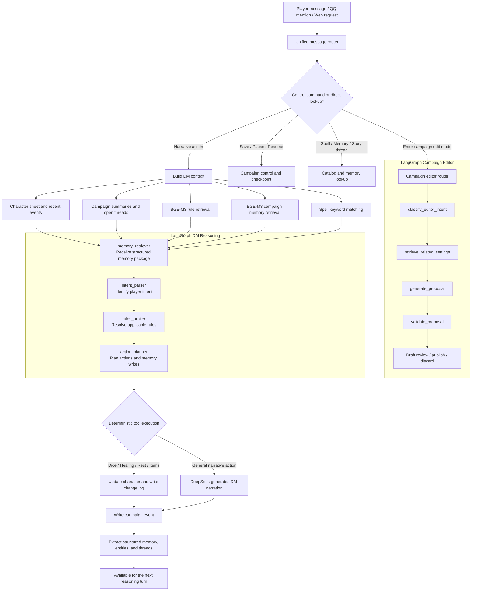

**English** | [简体中文](README-cn.md)

# DND DM Agent

A local-first AI tabletop system for long-running DND campaigns. It provides both a complete
**DM Mode** and a tool-focused **Dice Assistant Mode**. Both modes operate on the same campaign,
characters, memories, and combat state, and may be switched without losing progress.

The project treats play as persistent structured state rather than disposable chat. Character sheets,
NPCs, monsters, items, effects, campaign settings, plot progress, events, memories, and combat state are
queryable and auditable data. The LLM handles natural-language understanding, narration, and roleplay;
deterministic Python tools handle rolls, calculations, state changes, and persistence.

## Two Play Modes

### DM Mode

DM Mode lets the AI host a complete campaign as the Dungeon Master.

- Advances established plots from the current scene, campaign canon, historical events, and player actions.
- Describes environments and outcomes while portraying present NPCs and monsters.
- Reads private NPC profiles, secrets, motivations, voices, story responsibilities, and planned actions.
- Retrieves rulebooks, spells, character sheets, campaign settings, and memories while resolving actions.
- Records events, character changes, story threads, and structured memory for long-running continuity.
- Uses exactly the same deterministic combat mechanics as Dice Assistant Mode while retaining narration, NPC roleplay, and plot presentation.

### Dice Assistant Mode

Dice Assistant Mode supports real players and a real DM. It does not proactively advance a plot,
describe environments, or portray NPCs, but retains the full tabletop toolset.

- Answers questions about character sheets, abilities, spells, rules, items, campaign progress, and recorded facts.
- Executes checks, rolls, damage, healing, item use, effects, and combat hosting.
- Remains inside the current campaign and continues using its scene, public settings, actors, and memories.
- Audits mentioned operations and present actors, and can update memory from current, replied-to, or confirmed earlier messages.
- Outputs facts, rules, calculations, state changes, and necessary clarification only, without unsolicited advice or roleplay prose.

## DM Campaign System

### Campaign Progression and Long-term Memory

Every action and result is stored in an event log. Events feed structured memories, entity state,
open story threads, and summaries. DM reasoning retrieves the facts and relationships relevant to the
current scene instead of relying only on the latest chat messages.

- Supports free play, non-combat turn order, and combat turn order.
- Supports pause, resume, checkpoints, and full campaign-state recovery.
- Uses local BGE-M3 retrieval for rulebooks and campaign memory.
- Writes every character mutation to a change log and every action to a campaign event.
- Records relevant rules, spells, memories, character versions, rolls, and state changes for auditing.

### Conversational Campaign Editing

DMs can enter an isolated editing mode to create or revise locations, NPCs, factions, lore, quests,
timelines, rules, and arbitrary homebrew settings without advancing play.

- Changes begin as drafts and are published only after review.
- Supports comments, undo, discard, conflict validation, and version history.
- Provides relationship graphs, timelines, starter templates, NPC conversion, and campaign package import/export.
- Published settings are retrieved during play, and contradictory events may create review drafts.

### NPCs and Monsters

NPCs and monsters use the same structured character and combat foundation as players. They additionally
store private DM material such as persona, voice, mannerisms, goals, fears, secrets, knowledge, attitude,
roleplay instructions, story responsibilities, triggers, and planned actions. Presence state determines
which actors exist in the current scene and enter initiative.

## Shared Combat System

Detailed guide: [Combat System](docs/COMBAT_SYSTEM.md) | [中文说明](docs/COMBAT_SYSTEM-cn.md)

DM Mode and Dice Assistant Mode use the same combat mechanics pipeline. Initiative, participant cards,
target resolution, reactions, rolls, effects, and turn advancement behave identically. The only
difference is that DM Mode may add narration and roleplay.

### Turns and Participants

- Combat begins only after confirming participants; actors without entity character sheets cannot enter.
- The system rolls initiative for every participating player, NPC, and monster.
- The current turn accepts actions only from the appropriate player or DM.
- NapCat mentions the QQ user bound to a player character when their turn begins.
- Turns advance only after resolution, and ending combat returns the campaign to free play.

### Character and Target Mechanics

- Every combat action receives cropped mechanical cards for all participants and a focused target-card set.
- AC, HP, modifiers, skills, saves, initiative, and spellcasting values must come from entity character sheets, never guessed chat values.
- Players, NPCs, and monsters share the same schema for sheets, items, spells, effects, and change history.
- QQ character bindings are campaign-specific and switch with the active campaign.

### Effects and Reactions

- Equipment, buffs, debuffs, spells, and homebrew items generate a live `effective` mechanical snapshot without overwriting base stats.
- Supports duration ticks, stacking, concentration, advantage/disadvantage, bonus dice, consumption, and combat-end cleanup.
- Actions that may trigger reactions are announced before any roll result is shown.
- Eligible players are mentioned and asked for a decision; automated actors also explicitly decide whether to react.
- Rolls, resolution, and turn advancement occur only after every reaction decision is complete.

## Supporting Capabilities

### Character Sheets, Items, and Creation

- Implements point buy, modifiers, proficiency, skills, saves, HP, AC, and spellcasting formulas extracted from the Excel sheet template.
- Stores weapons, armor, consumables, containers, charges, currency, equipment effects, and arbitrary homebrew items structurally.
- Supports character versions, change history, Excel export, and per-campaign QQ bindings.

### Rules, Spells, and Multi-file Parsing

- Parses text, Markdown, JSON, CSV, HTML, DOCX, PPTX, PDF, and ZIP files.
- Indexes rulebooks and campaign memory with local BGE-M3 embeddings.
- Merges multiple Excel spell lists and supports bilingual names, keyword lookup, and natural-language queries.
- Injects matching rules and spell entries into relevant actions.

### QQ and NapCat

- Supports OneBot v11 group and private messages; group messages require mentioning the bot by default.
- Supports replies, confirmed group history, attachment downloads, and multi-file parsing.
- An empty allowlist permits all users while DM permissions remain separate from player permissions.
- Includes Windows launch, login, and character-binding scripts.

## LangGraph Reasoning Flow

LangGraph currently owns reasoning and action planning. Tool execution, state persistence, and memory indexing remain in the service layer. This keeps natural-language reasoning flexible while making character values and campaign state verifiable, recoverable, and auditable.



## Campaign Memory Model

| Layer | Purpose |
| --- | --- |
| `CampaignEvent` | Immutable raw action and result log for auditing |
| `CampaignSummary` | Compressed session or campaign history |
| `CampaignMemory` | Retrievable facts, decisions, events, and story-thread memories |
| `CampaignEntity` | Current state of characters and other entities |
| `CampaignThread` | Unresolved quests, promises, and story threads |
| `CampaignCheckpoint` | Snapshot of campaign configuration and every character |

Memory commands:

```text
/memory silver key
/threads
/turns
/free
/combat      DM only
/endcombat   DM only
/next        DM only
```

## Technology Stack

- Backend: Python 3.12, FastAPI, SQLAlchemy, LangGraph
- LLM: DeepSeek OpenAI-compatible API
- Embeddings: local `BAAI/bge-m3`, 1024-dimensional vectors
- Storage: local SQLite mode or PostgreSQL with pgvector
- Frontend: Next.js 16, React 19
- Integration: NapCat / OneBot v11
- Tooling: uv, Docker Compose, pytest

## Quick Start

### Local Backend

Requires Python 3.12 and [uv](https://docs.astral.sh/uv/).

```powershell
Copy-Item .env.example .env
cd backend
uv sync
uv run uvicorn app.main:app --host 127.0.0.1 --port 8011
```

Open:

- API documentation: <http://127.0.0.1:8011/docs>
- Health check: <http://127.0.0.1:8011/health>

By default, every local entrypoint now uses the same SQLite database:
`D:\mcp\DM_agent\data\dm_agent.db`

Initialize the demo campaign:

```powershell
Invoke-RestMethod -Method Post http://127.0.0.1:8011/demo/bootstrap
Invoke-RestMethod -Method Post http://127.0.0.1:8011/ingest/compendium
Invoke-RestMethod -Method Post http://127.0.0.1:8011/ingest/rules
```

### Frontend

```powershell
run_webui.bat
```

Open <http://127.0.0.1:3001>. Port `3000` is reserved for the local NapCat OneBot HTTP service. The latest WebUI includes play and turn controls, conversational campaign editing, draft review, memory and story-thread views, rule/spell retrieval, and character status.

### Docker Compose

Docker mode starts PostgreSQL, pgvector, Redis, the backend, worker, frontend, and Adminer.

```powershell
Copy-Item .env.example .env
docker compose up --build -d
```

| Service | URL |
| --- | --- |
| Web UI | <http://localhost:3000> |
| API / Swagger | <http://localhost:8011/docs> |
| Adminer | <http://localhost:8080> |

## Configuration

Important environment variables:

```env
DEEPSEEK_API_KEY=
DEEPSEEK_BASE_URL=https://api.deepseek.com
LLM_MODEL=deepseek-chat

EMBEDDING_MODEL=BAAI/bge-m3
EMBEDDING_BACKEND=local_bge_m3
EMBEDDING_DEVICE=auto

NAPCAT_BASE_URL=
NAPCAT_TOKEN=
NAPCAT_SELF_ID=
NAPCAT_ALLOWED_USER_IDS=
NAPCAT_DM_USER_IDS=
NAPCAT_REQUIRE_GROUP_AT=true
```

- Empty `NAPCAT_ALLOWED_USER_IDS`: all QQ users may use the bot.
- Empty `NAPCAT_DM_USER_IDS`: no QQ user may execute DM control commands.
- `NAPCAT_REQUIRE_GROUP_AT=true`: group messages must mention the bot.

## NapCat / QQ

Windows helper scripts:

```text
login_napcat_dnd.bat
run_napcat_installedqq.bat
run_napcat_callback.bat
run_napcat_localqq.bat
manage_qq_bindings.bat
```

- `login_napcat_dnd.bat`: recommended entry point; starts the DM callback and installed QQ.
- `run_napcat_installedqq.bat`: starts only the NapCat-injected installed QQ.
- Append `--check` to a QQ launcher to validate its installation path without opening QQ.

NapCat OneBot HTTP Post URL:

```text
http://127.0.0.1:8011/napcat/callback
```

Manage QQ user-to-character bindings:

```powershell
manage_qq_bindings.bat characters
manage_qq_bindings.bat list
manage_qq_bindings.bat bind 123456789 char_001 --name PlayerName
manage_qq_bindings.bat unbind 123456789
```

NapCat is shared outside the repository at `D:\mcp\napcat`. The launchers use `D:\mcp\napcat\pkg` first, then fall back to `NAPCAT_SOURCE_DIR` or the legacy `tools/napcat` path. Set `NAPCAT_CALLBACK_PORT` to override the default callback port `8011`.

## Importing Rulebooks and Source Material

The public repository does not include third-party rulebooks, character-sheet templates, spell spreadsheets, real campaign databases, or generated character sheets. Place materials you are authorized to use under:

```text
data/raw/
```

Parse and ingest a rulebook:

```powershell
curl.exe -X POST http://127.0.0.1:8011/parse/rulebooks `
  -F "files=@data/raw/your-rulebook.pdf" `
  -F "system_version=DND_5E_2014"
```

Install optional parsing backends:

```powershell
uv run scripts/install_parse_backends.py --backend pdf_ocr
uv run scripts/install_parse_backends.py --backend whisper
uv run scripts/install_parse_backends.py --backend markitdown
```

## Common API Endpoints

| Feature | API |
| --- | --- |
| DM conversation | `POST /chat/{campaign_id}` |
| Multi-file parsing | `POST /parse/files` |
| Parse and ingest rulebooks | `POST /parse/rulebooks` |
| Rule search | `GET /rules/search` |
| Spell search | `GET /spells` |
| Build a character | `POST /characters/build` |
| NPC and monster cards | `GET /campaigns/{campaign_id}/actors` |
| DM actor roleplay profile | `GET/PATCH /characters/{character_id}/roleplay` |
| Actor scene presence | `PATCH /characters/{character_id}/presence` |
| Item schema catalog | `GET /characters/items/schema` |
| Normalize existing inventories | `POST /campaigns/{campaign_id}/characters/inventory/normalize` |
| Inspect effect JSON schema | `GET /characters/effects/schema` |
| Inspect a character's effective mechanical snapshot | `GET /characters/{character_id}/effective` |
| Export a character sheet | `GET /characters/{character_id}/sheet` |
| Campaign events | `GET /campaigns/{campaign_id}/events` |
| Campaign memories | `GET /campaigns/{campaign_id}/memories` |
| Published campaign settings and search | `GET /campaigns/{campaign_id}/settings` |
| Setting drafts and publishing | `/campaigns/{campaign_id}/setting-drafts` |
| Setting history and comments | `/campaigns/{campaign_id}/setting-history`, `/setting-comments` |
| Setting validation and conflicts | `/campaigns/{campaign_id}/settings/validate`, `/settings/conflicts` |
| Setting relationship graph and timeline | `/campaigns/{campaign_id}/setting-graph`, `/timeline` |
| Campaign package import/export | `/campaigns/{campaign_id}/package` |
| Entity state | `GET /campaigns/{campaign_id}/entities` |
| Open story threads | `GET /campaigns/{campaign_id}/threads` |
| Backfill historical memory | `POST /campaigns/{campaign_id}/memories/backfill` |
| Checkpoints | `GET /campaigns/{campaign_id}/checkpoints` |
| QQ bindings and active campaign | `/napcat/bindings`, `/napcat/active-campaign`, `PATCH /characters/{id}/qq-bindings` |

## Campaign Commands

```text
/help
/status
/save       DM only
/pause      DM only
/resume     DM only
/spell Fireball
/memory silver key
/threads
/editcampaign        DM only
/drafts
/publishsettings     DM only
/undodraft           DM only
/discardsettings     DM only
/exitedit            DM only
/diceassistant       DM only
/exitdice            DM only
```

Chinese command aliases such as `/帮助`, `/保存`, `/法术`, `/记忆`, and `/剧情线` are also supported.

## Tests

```powershell
cd backend
uv run pytest -q

cd ../frontend
npm run build
```

## Project Structure

```text
backend/app/
  agents/dm_graph.py       LangGraph DM reasoning graph
  agents/campaign_editor_graph.py  LangGraph campaign editor
  campaign_editor.py       Structured settings, drafts, history, and packages
  campaign_memory.py       Memory extraction, backfill, and retrieval
  campaign_control.py      Save, pause, resume, and checkpoints
  message_router.py        Shared QQ and HTTP message routing
  services.py              Context building, tool execution, and event writes
  parsing/                 Multi-file and multimodal parsing
  rag/                     BGE-M3 embeddings and rule retrieval
  tools/                   Dice, character building, formulas, and spell catalog
frontend/                  Next.js Web UI
scripts/                   Optional parsing-backend installers
data/                      Local rules, source material, and runtime data
```

## Current Boundaries

- LangGraph currently covers DM reasoning and planning; tools are still executed by the service layer.
- Structured memory extraction is currently deterministic and can later be extended with LLM extraction and human review.
- Full combat rounds, map positioning, and complete encounter management remain future work.
- This project does not include DND rulebooks, character-sheet templates, NapCat, or other copyrighted third-party material.
